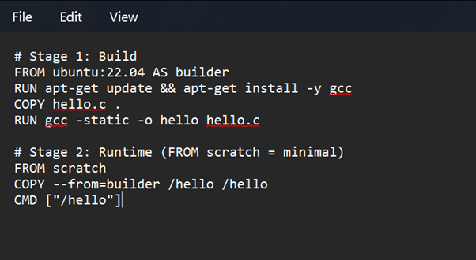
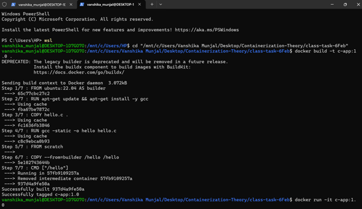
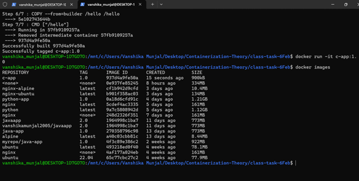

# CONTAINERIZATION AND DEVOPS THEORY

## 10 FEBRUARY 2026
### MULTISTAGE DOCKERFILES

**Reference Link:**  
https://upessocs.github.io/#dir=/Lectures/Containerization%20and%20DevOps/Theory/&file=019%20Multistage%20Dockerfiles%20Best%20Practices%20size,%20speed%20and%20security.md

---
### Screenshots of commands  

C Hello World Code    

Dockerfile (Multistage)  

### 1. Enter wsl
`wsl`

---

### 2. Changing directory
`cd "/mnt/c/Users/Vanshika Munjal/Desktop/Containerization-Theory/class-task-6Feb"`  

---

### 3. Building image from Dockerfile
`docker build -t c-app:1.0 .`  

docker build → build an image from a Dockerfile  
-t c-app:1.0 → tag the image  
c-app = image name  
1.0 = version  
. → current directory contains the Dockerfile  
So Docker looks for a file named Dockerfile in this folder.  

---

### 4. Starting container
`docker run -it c-app:1.0`  

Container starts
CMD ["./hello"] executes

---

### 5. List all Docker images present on the system
`docker images`

---

### Dockerfile Code Explanation
`FROM ubuntu:22.04 AS builder`
Uses Ubuntu 22.04 as the base image and names this stage builder for compiling the program.

`RUN apt-get update && apt-get install -y gcc`
Updates package lists and installs the GCC compiler inside the container.

`COPY hello.c .`
Copies the C source file from the host system into the container.

`RUN gcc -static -o hello hello.c`
Compiles the C program into a statically linked executable named hello.

`FROM scratch`
Starts a new minimal image with no operating system or libraries.

`COPY --from=builder /hello /hello`
Copies only the compiled binary from the builder stage into the final image.

`CMD ["./hello"]`
Specifies the default command to run the C program when the container starts.

---

### Conclusion
The Docker image is very small because a multi-stage build is used where the C program is compiled in a separate builder stage and only the final compiled binary is copied into the runtime image. The final image uses scratch as the base image, which contains no operating system, no libraries, and no package manager. Additionally, the C program is compiled as a statically linked binary, so it does not require any external runtime dependencies. As a result, the final image contains only a single executable file, making the image size extremely small (less than 1 MB).
