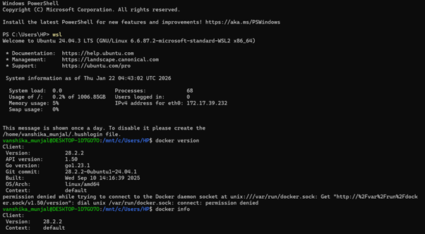
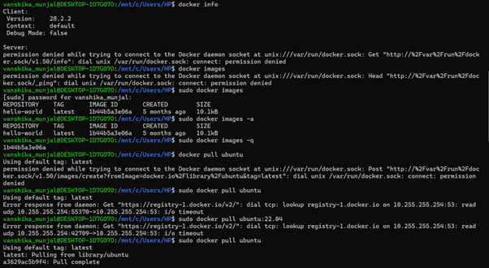
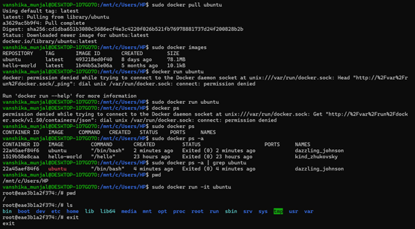
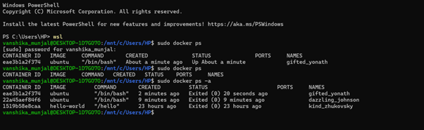
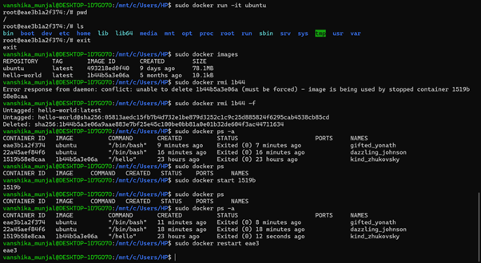

# CONTAINERIZATION AND DEVOPS THEORY

## 22 JANUARY 2026
### DOCKER BASIC COMMANDS

**Reference Link:**  
https://upessocs.github.io/#dir=/Lectures/Containerization%20and%20DevOps/Theory/Containerization%20and%20DevOps/Theory/&file=011%20Docker%20basic%20commands.md

---
### Screenshots of commands

### 1. Enter wsl
`wsl`

---

### 2. Check docker version
`docker version`  
`docker info`

---

### 3. Image Management
  * List local images  
    `sudo docker images`  

  * Show all images  
    `docker images -a`

  * Only image IDs  
    `docker images -q`

---

### 4. Pull image from registry
`sudo docker pull ubuntu`  

  * specifies version  
  `sudo docker pull ubuntu:22.04`  

---

### 5. List all Docker images present on the system
`sudo docker images`

---

### 6. Creating a new container from Ubuntu image
The container starts and immediately exits  

`sudo docker run ubuntu`

---

### 7. Shows containers
 * Show all running containers  
  `sudo docker ps`  

 * Show all containers (running+stopped+exited)  
  `sudo docker ps -a`

 * Show only container IDs  
  `sudo docker ps -q`

 * Filter ubuntu related containers  
  `sudo docker ps -a | grep ubuntu`
---

### 8. Creating a new container from Ubuntu image
it= interactive terminal  
you are inside ubuntu container  

`sudo docker run -it ubuntu`

now you are inside container

---

### 9. Checking current directory

`pwd`  

Docker containers have their own isolated filesystem
/ is the root directory of the container  
It is NOT connected to your Windows folders by default

---

### 10. Showing linux directories

`ls`  

You are now inside a real Linux environment.

---

### 11. Checking if the container is running (in another terminal)

`wsl`  
`sudo docker ps`

 The container is running

---

### 12. Exiting container

`exit`  

 Exiting shell = container stops if no background process.

---

### 13. Again checking if container is running (in another terminal)

`sudo docker ps`  
`sudo docker ps -a`

The container is stopped.

---

### 14. Removing images

`sudo docker images`  
`sudo docker rmi 1b44` (error: The Ubuntu image is still linked to stopped containers, Docker protects images from deletion if containers exist)  
`sudo docker rmi 1b44 -f` (force remove)    

`sudo docker ps -a` (shows all containers (running + stopped), Containers still exist, but their image has been removed, they cannot be restarted properly now)

---

### 15. Start and restart containers

`sudo docker ps`  
`sudo docker start 1519b`  
`sudo docker ps -a`  
`sudo docker restart eae3`  

---
