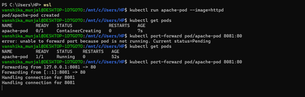
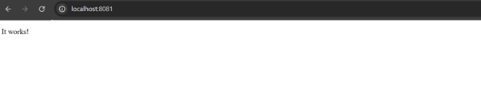
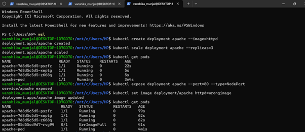
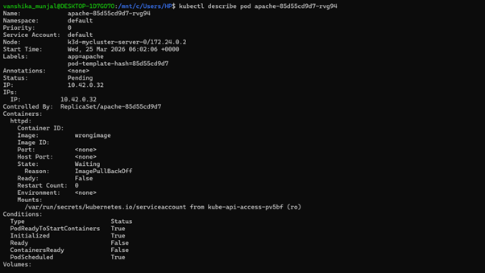
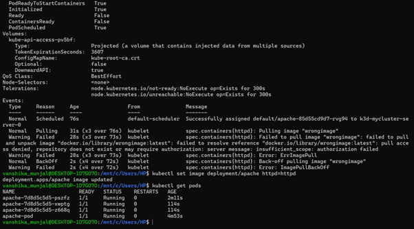

# CONTAINERIZATION AND DEVOPS THEORY

## 25 MARCH 2026
### CLASS TASK: RUN AND MANAGE A "HELLO WEB APP"

**Reference Link:**  
https://upessocs.github.io/#dir=/Lectures/Containerization%20and%20DevOps/Theory/003%20Unit%203/&file=306%20Apache%20webserver%20deploy%20using%20kubernetis.md  

## 📌 Objective

Deploy and manage a simple Apache-based web server using Kubernetes and perform the following tasks:
- Run the application
- Verify it is running
- Access the application
- Scale the application
- Debug and fix issues

---

### Screenshots of commands
  

  

  

  

  

---

## 🧾 Step-wise Explanation of Commands

### 🔹 Step 1: Run a Pod

**Command:**
`kubectl run apache-pod --image=httpd`

**Explanation:**  
This command creates a Pod named `apache-pod` using the Apache (`httpd`) image.

---

### 🔹 Step 2: Verify Pod Status

**Command:**
`kubectl get pods`

**Explanation:**  
This command checks the status of the Pod. Initially, it shows `ContainerCreating`, and after some time it changes to `Running`.

---

### 🔹 Step 3: Access the Application

**Command:**
`kubectl port-forward pod/apache-pod 8081:80`

**Explanation:**  
This command forwards local port `8081` to container port `80`, allowing access to the web application.

**Open in Browser:**  
`http://localhost:8081`

**Output:**  
The Apache default page ("It works!") is displayed.

---

### 🔹 Step 4: Create Deployment

**Command:**
`kubectl create deployment apache --image=httpd`

**Explanation:**  
This command creates a Deployment named `apache`, which manages Pods and supports scaling.

---

### 🔹 Step 5: Verify Deployment

**Command:**
`kubectl get deployments`  
`kubectl get pods`

**Explanation:**  
These commands verify that the Deployment is created and Pods are running.

---

### 🔹 Step 6: Scale the Application

**Command:**
`kubectl scale deployment apache --replicas=3`

**Explanation:**  
This command increases the number of Pods to 3, improving availability and load handling.

---

### 🔹 Step 7: Verify Scaling

**Command:**
`kubectl get pods`

**Explanation:**  
This confirms that multiple Pods (3 replicas) are running.

---

### 🔹 Step 8: Expose Deployment

**Command:**
`kubectl expose deployment apache --port=80 --type=NodePort`

**Explanation:**  
This exposes the Deployment as a Service, enabling external access.

---

### 🔹 Step 9: Break the Application (Debugging)

**Command:**
`kubectl set image deployment/apache httpd=wrongimage`

**Explanation:**  
This intentionally sets an incorrect image to simulate a failure scenario.

---

### 🔹 Step 10: Check Error

**Command:**
`kubectl get pods`

**Explanation:**  
Some Pods enter `ErrImagePull` or `ImagePullBackOff`, indicating failure to fetch the image.

---

### 🔹 Step 11: Diagnose the Issue

**Command:**
`kubectl describe pod <pod-name>`

**Explanation:**  
This shows detailed Pod information. The Events section reveals the image pull failure.

---

### 🔹 Step 12: Fix the Application

**Command:**
`kubectl set image deployment/apache httpd=httpd`

**Explanation:**  
This restores the correct image and resolves the issue.

---

### 🔹 Step 13: Final Verification

**Command:**
`kubectl get pods`

**Explanation:**  
All Pods return to the `Running` state, confirming successful recovery.

---

## ✅ Conclusion

The Apache web application was successfully deployed, accessed, scaled, debugged, and restored using Kubernetes.  

## 🔥 Key Learnings

- Kubernetes Pods run containerized applications  
- Deployments help in scaling and managing Pods  
- Services expose applications externally  
- Errors like `ErrImagePull` help identify issues  
- Kubernetes supports self-healing and easy debugging  
