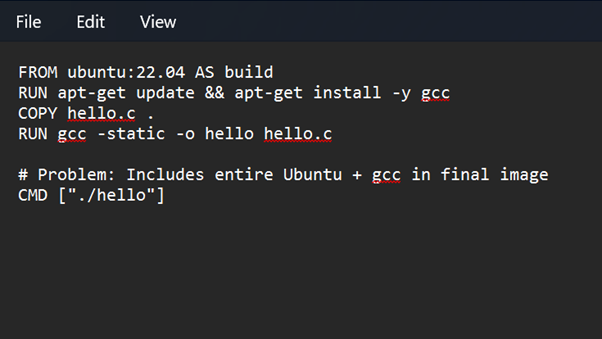
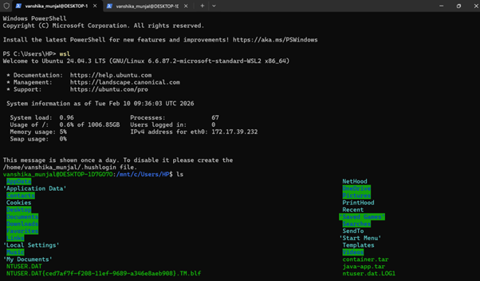
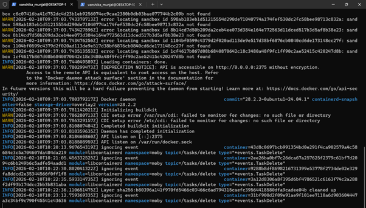
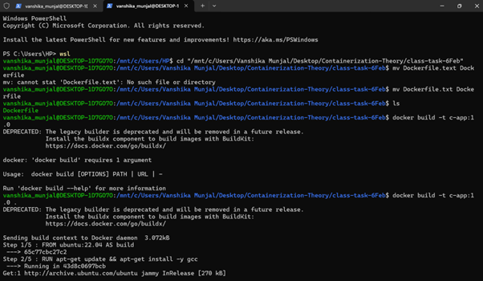
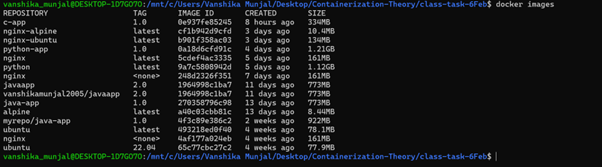

# CONTAINERIZATION AND DEVOPS THEORY

## 06 FEBRUARY 2026
### SINGLESTAGE DOCKERFILES

**Reference Link:**  
-

---
### Screenshots of commands  
    
Dockerfile (Singlestage)  

C Hello World Code  

Running Demon  

### 1. Enter wsl
`wsl`

---

### 2. Changing directory
`cd "/mnt/c/Users/Vanshika Munjal/Desktop/Containerization-Theory/class-task-6Feb"`  

---

### 3. Renaming the file from Dockerfile.txt to Dockerfile
`mv Dockerfile.txt Dockerfile`

---

### 4. Building image from Dockerfile
`docker build -t c-app:1.0 .`  

docker build → build an image from a Dockerfile  
-t c-app:1.0 → tag the image  
c-app = image name  
1.0 = version  
. → current directory contains the Dockerfile  
So Docker looks for a file named Dockerfile in this folder.  

---

### 5. Starting container
`docker run -it c-app:1.0`  

Container starts
CMD ["./hello"] executes

---

### 6. List all Docker images present on the system
`docker images`

---

### Dockerfile Code Explanation
`FROM ubuntu:22.04 AS build`
Uses Ubuntu 22.04 as the base image and names this stage build.

`RUN apt-get update && apt-get install -y gcc`
Updates package lists and installs the GCC compiler inside the image.

`COPY hello.c .`
Copies the C source file from the host system into the container.

`RUN gcc -static -o hello hello.c`
Compiles the C program into a statically linked executable named hello.

`# Problem: Includes entire Ubuntu + gcc in final image`
Comment indicating that this approach results in a large image containing unnecessary build tools.

`CMD ["./hello"]`
Specifies the default command to run the compiled program when the container starts.

---

### Conclusion
In a single-stage Docker build, the same image is used for both building and running the application, which makes the process simple but results in a large image size because the final image includes unnecessary components such as the operating system and build tools (e.g., GCC).
