# Containerization Project 🐳

Dockerized Web Application using **Node.js + Express + PostgreSQL** with **Docker Compose** and **Macvlan Networking**.

---

[View Project Report](Containerization_ProjectReport_VanshikaMunjal_500121784.pdf)  

---

## 📁 Project Structure

```
containerization-project-1
│
├── backend
│   ├── Dockerfile
│   ├── package.json
│   ├── package-lock.json
│   ├── server.js
│   └── .dockerignore
│
├── database
│   └── Dockerfile
│
├── docker-compose.yml
├── project-ss
│   └── screenshots
│
└── README.md
```

---

## 🎯 Objective

The objective of this project is to:

- Containerize a web application using Docker
- Use **Node.js + Express** as backend
- Use **PostgreSQL** as database
- Use **Docker Compose** for orchestration
- Implement **Macvlan networking**
- Verify container networking, volumes, and API functionality

---

## 🌐 Step 1: Create Macvlan Network

```bash
docker network create \
--driver macvlan \
--subnet 172.30.0.0/24 \
--gateway 172.30.0.1 \
-o parent=eth0 \
lan_net
```

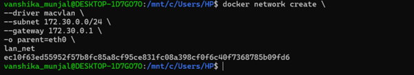

---

## 🌐 Step 2: List Docker Networks

```bash
docker network ls
```

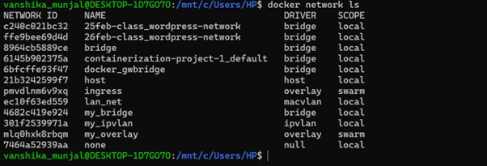

---

## 🔍 Step 3: Inspect Macvlan Network

```bash
docker network inspect lan_net
```

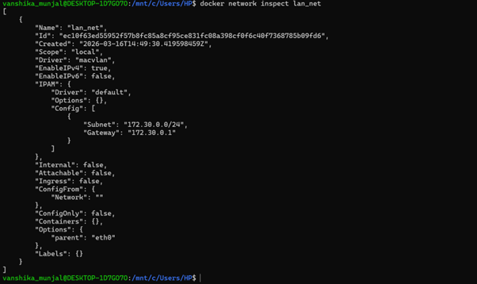

---

## 🚀 Step 4: Build and Start Containers

```bash
docker-compose up --build
```

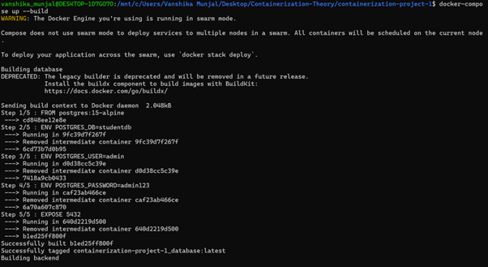
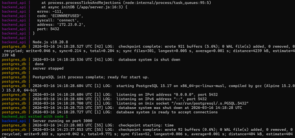

This confirms that the backend and PostgreSQL containers start successfully.

---

## 🐳 Step 5: Check Running Containers

```bash
docker ps
```

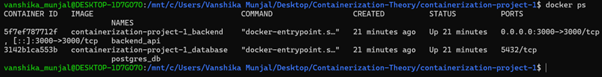

Running containers:

- backend_api
- postgres_db

---

## 🌐 Step 6: Inspect Docker Compose Network

```bash
docker network inspect containerization-project-1_default
```

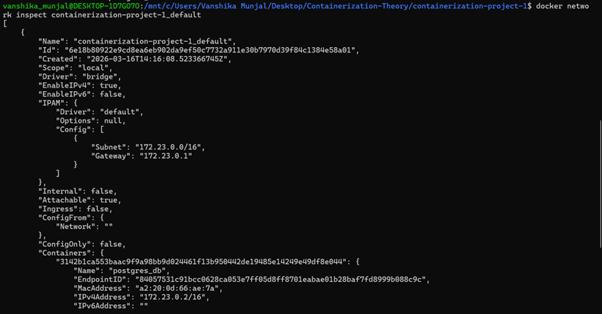

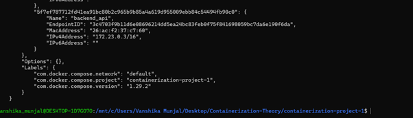

This shows the containers connected to the Docker network.

---

## 🔌 Step 7: Health Check API

Endpoint:

```
GET /health
```

Test in browser:

```
http://localhost:3000/health
```

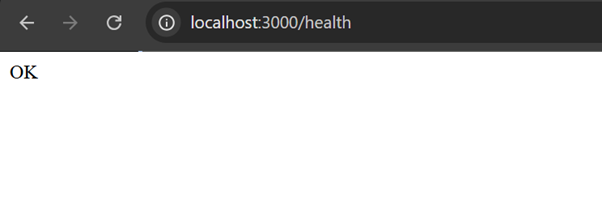

The response **OK** confirms the backend service is running.

---

## ➕ Step 8: Insert Student Record

```bash
curl -X POST http://localhost:3000/students \
-H "Content-Type: application/json" \
-d '{"name":"Vanshika","age":21}'
```

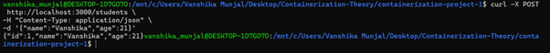

The student record is successfully inserted into PostgreSQL.

---

## 📥 Step 9: Fetch Student Records

```bash
curl http://localhost:3000/students
```

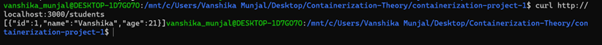

The inserted student record is retrieved successfully.

---

## 🌐 Step 10: Browser Testing

Students endpoint tested in browser:

```
http://localhost:3000/students
```

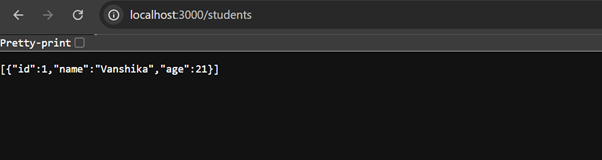

---

## 📡 Step 11: Verify Container IP Addresses

Backend container IP:

```bash
docker inspect backend_api | grep IPAddress
```

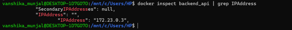

Database container IP:

```bash
docker inspect postgres_db | grep IPAddress
```

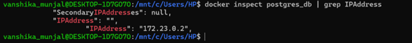

This confirms both containers are connected to the Docker network.

---

## 💾 Step 12: Persistent Storage Proof

```bash
docker-compose down
docker-compose up
```

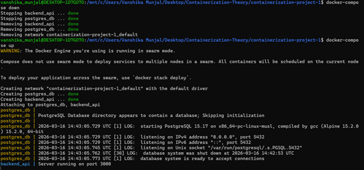


This confirms persistent storage for PostgreSQL data.

---

## 📦 Step 13: Docker Images

```bash
docker images
```

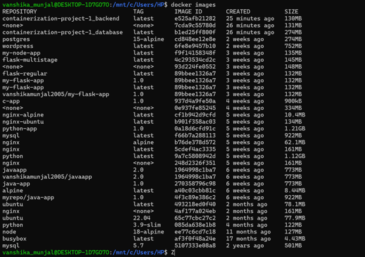

This shows the Docker images used in this project.

---

## ✔ Verification Summary

The following components were successfully verified:

- Macvlan network created successfully  
- Docker containers built and running  
- Backend API responding correctly  
- PostgreSQL database connected  
- Student record inserted using POST request  
- Student records retrieved using GET request  
- Browser API testing successful  
- Container IP addresses verified  
- Docker volumes created for persistence  
- Docker images built successfully  

---

## 👩‍💻 Author

**Vanshika Munjal**  
**SapId: 500121784**  
B.Tech – UPES
